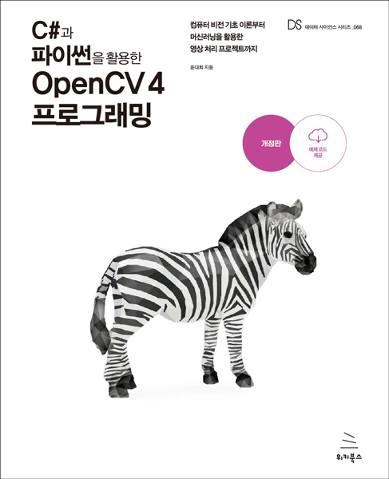

# C#과 파이썬을 활용한 OpenCV4 프로그래밍



예제 코드 및 데이터 파일입니다. 책에 기술된 예제들은 각 Chapter 폴더에 포함돼 있습니다.

폴더에는 **Example-장수-예제번호-언어형식**으로 구성돼 있습니다.

모든 예제에는 코드에서 사용되는 **이미지 또는 동영상이 저장돼 있습니다.**

<br>

## Notice

각각의 예제는 실행되는 환경에 따라 결과가 약간씩 다를 수 있습니다.
OpenCV 버전, 운영체제, 내부 코덱, 환경 변수, 종속성 라이브러리 등에 따라 동일한 코드여도 결과가 달라집니다.
대표적으로 그레이스케일이 내부 코덱에 따라 변환됩니다. 또한, OpenCV의 버전에 따라 아래와 같이 반환값, 플래그 등이 다를 수 있습니다.

```
# 3.3 이하
con_img, contours, hierachy = cv2.findContours(src, cv2.RETR_LIST, cv2.CHAIN_APPROX_NONE)

# 4.x
contours, hierachy = cv2.findContours(src, cv2.RETR_LIST, cv2.CHAIN_APPROX_NONE)
```

운영체제나 내부 코덱에 따라 실행 결과나 과정이 다른 경우, 주석으로 표기했습니다.

<br>

머신러닝 예제 8장(Chapter8) 일부와 실전 예제 9장(Chapter9)과 10장(Chatper10)는 순차적으로 프로젝트를 완성해가는 방식입니다.
그러므로 일부 예제는 아무런 동작을 하지 않거나, 실행되지 않는게 정상입니다.
책에서는 코드가 추가되는 부분이나 변경되는 부분만 작성하므로, 해당 예제들은 전체적인 코드 진행 방식을 확인하거나 특정 예제에서부터 이어 작성하는 것을 권장합니다.

**종속적인 데이터 파일(tessdata, saved_model 등)은 프로젝트 내부에 포함되어 있지 않습니다.**
저장소의 코드를 직접 실행하는 경우, 각 Chapter에 포함된 데이터 파일을 올바른 경로로 이동하거나 코드의 경로를 수정해 활용하시기 바랍니다.

<br>

## C# - OpenCvSharp

C# 예제는 `packages.config`를 사용해 종속성 패키지를 설치합니다.
자동으로 최신 패키지로 설치하지 않으므로, `NuGet 패키지 관리`에서 사용하려는 버전으로 업데이트 후 활용하실 수 있습니다. 
예제의 솔루션 파일을 활용하지 않는 경우, 책의 설명과 같이 **NuGet 패키지**를 통해 설치하실 수 있습니다.

Visual Studio에서 `Ctrl + F5` 키로 **디버깅 하지 않고 실행(Start without debugging)** 할 수 있습니다. 
프로그램이 종료되도 콘솔 창이 사라지지 않습니다.

`Example-01-02-C#`는 빌드된 이 후에 정상적으로 표시됩니다.

<br>

## Python - OpenCV

10장의 텐서플로가 실행되지 않는다면, 사용하는 CPU의 `AVX(Advanced Vector Extensions)` 지원 유무를 확인하시길 바랍니다.
GPU를 사용하는 경우에는 [Tensorflow 빌드 페이지](https://www.tensorflow.org/install/source_windows#gpu)에서 설치한 텐서플로의 `cuDNN`과 `CUDA` 버전을 확인하시길 바랍니다.
GPU로 사용할 때, 메모리 관련 오류가 발생한다면 아래의 메서드를 사용해 텐서플로에서 접근할 수 있는 GPU를 조정합니다.

```

import tensorflow as tf
physical_device = tf.config.list_physical_devices('GPU')
tf.config.experimental.set_memory_growth(physical_device[0], enable=True)

```

예제 10.09(Example-10-09-Py)은 **라벨 맵 유틸리티 함수**를 활용합니다. [TensorFlow-Object_Detection](https://github.com/tensorflow/models/tree/e6ce8cddd6a8b62922f07b632324903764f14855/research/object_detection)에서 전체 코드를 받을 수 있습니다.
단, TensorFlow models는 릴리스에 따라 파일의 위치나 코드가 변경돼 오류가 발생하므로 Example-10-09-Py의 라벨 맵 유틸리티 함수 사용을 권장합니다.

<br>

## Additional

`Additional` 폴더에는 **Windows Forms 앱**과 **tkinter**로 GUI를 생성해 OpenCV를 활용한 예제를 확인할 수 있습니다.
코드 본문에 주석이 작성돼 있습니다.

<br>

## 문의

질문이나 공유사항 등은 책에 기재된 이메일이나 [블로그](https://076923.github.io/) 통해 문의하실 수 있습니다.
